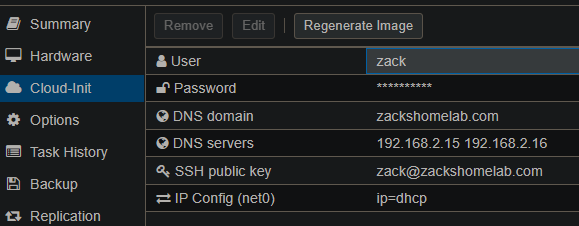

# Terraform Module for Proxmox Cloudinit Virtual Machines

This module supports the following configurations:
* Create a Virtual Machine from a QEMU-Enabled template.
* Combined the syntax of ipconfig0-15 and Networks for easier multi-network card configurations
* Support of multi-disk deployments

This module assumes you have a Virtual Machine template with QEMU installed. If you do not, follow the instructions under [Getting Started](#getting-started) to create yourself a template.

# Table of Contents

- [Terraform Module for Proxmox Cloudinit Virtual Machines](#terraform-module-for-proxmox-cloudinit-virtual-machines)
- [Table of Contents](#table-of-contents)
- [Usage](#usage)
  - [Basic Deployment](#basic-deployment)
  - [Multiple Disks](#multiple-disks)
  - [Multiple Network Adapters](#multiple-network-adapters)
- [Examples](#examples)
- [Getting Started](#getting-started)
  - [Step 1. Access Proxmox Shell](#step-1-access-proxmox-shell)
  - [Step 2. Download Ubuntu 22.04 image](#step-2-download-ubuntu-2204-image)
  - [Step 3. Install QEMU Agent](#step-3-install-qemu-agent)
  - [Step 4. Configure Virtual Machine Template](#step-4-configure-virtual-machine-template)
    - [Step 4a. Hardware Settings](#step-4a-hardware-settings)
    - [Step 4b. Cloudinit Credentials](#step-4b-cloudinit-credentials)
    - [Step 4c. Cloudinit Network Settings](#step-4c-cloudinit-network-settings)
  - [Step 5. Convert Virtual Machine to Template](#step-5-convert-virtual-machine-to-template)
- [Common Issues](#common-issues)
  - [Issue: Terraform timing out](#issue-terraform-timing-out)
  - [Issue: Cloudinit drive already exists](#issue-cloudinit-drive-already-exists)
  - [Issue: Terraform expects Cloudinit changes](#issue-terraform-expects-cloudinit-changes)
  - [Issue: Invalid parameter 'queues'](#issue-invalid-parameter-queues)
  - [Issue: Terraform Proxmox Provider Crashing](#issue-terraform-proxmox-provider-crashing)
    - [Crash: Incorrect Disk Hardware](#crash-incorrect-disk-hardware)
    - [Crash: SSD Emulation](#crash-ssd-emulation)
- [Terraform Module Information](#terraform-module-information)
  - [Requirements](#requirements)
  - [Providers](#providers)
  - [Modules](#modules)
  - [Resources](#resources)
  - [Inputs](#inputs)
  - [Outputs](#outputs)


# Usage

NOTE: To utilize this module, you ***MUST*** have a QEMU-Enabled Template. To see how to build one, follow the instructions under [Getting Started](#getting-started)

## Basic Deployment

```
module "cloudinit_vm" {
  source = "github.com/ZacksHomeLab/terraform-proxmox-cloudinit-vm"

  vm_name     = "ubuntu-simple-vm"
  target_node = "pve1"
  clone       = "name-of-template"

  # Disk virtio0
  disks = [{
    size    = "10G"
    storage = "local-pve"
  }]

  # Network Adapter net0
  networks = [{
    dhcp = true
  }]
}
```

## Multiple Disks

```
module "cloudinit_vm" {
  source = "github.com/ZacksHomeLab/terraform-proxmox-cloudinit-vm"

  vm_name     = "ubuntu-simple-vm"
  target_node = "pve1"
  clone       = "name-of-template"

  cores  = 2
  memory = 2048

  # Disk 1: virtio0
  # Disk 2: scsi0
  disks = [
    {
      size    = "20G"
      storage = "local-pve"
    },
    {
      size    = "10G"
      type    = "scsi"
      storage = "my-other-storage"
    }
  ]

  # Network Adapter net0
  networks = [{
    dhcp = true
  }]
}
```

## Multiple Network Adapters

```
module "cloudinit_vm" {
  source = "github.com/ZacksHomeLab/terraform-proxmox-cloudinit-vm"

  vm_name     = "ubuntu-simple-vm"
  target_node = "pve1"
  clone       = "name-of-template"

  cores  = 2
  memory = 2048

  # Disk 1: virtio0
  disks [{
    size    = "20G"
    storage = "local-pve"
  }]

  # Network Adapter 1: net0
  # Network Adapter 2: net1
  networks = [
    { 
      ip      = "192.168.2.51/24"
      gateway = "192.168.2.1"
      bridge  = "vmbr0
    },
    {
      ip       = "192.168.3.51/24"
      gateway  = "192.168.3.1"
      bridge   = "vmbr1"
      vlan_tag = 3
    }
  ]
}
```

# Examples

* [Simple-VM](/examples/simple-vm/) - Basic Virtual Machine deployment in Proxmox.
* [Multiple Network Adapters](/examples/multiple-nics/) - Virtual Machine with multiple Network Adapters.
* [Complete](/examples/complete/) - An advanced deployment with misc. configurations.

# Getting Started
You must have an image, template, or Clone that supports Cloudinit with QEMU Guest Agent installed. 

If you **DO NOT** have QEMU Guest Agent installed on your image, template, or clone, Terraform will timeout during said deployment while responding with `500` status codes as it cannot see the IP Address of said machine.

If you want to setup a template to test this moodule, steps 1 through 5 will demonstrate how to create a Virtual Machine template with Ubuntu 22.04.

## Step 1. Access Proxmox Shell
* First, we'll need to access our node's shell. 
* Log into your Proxmox's node via SSH or Web Browser

## Step 2. Download Ubuntu 22.04 image
* We will need a Cloudinit-based image. In this example, I will be downloading Ubuntu 22.04 (Jammy). For other releases, you can retrieve said URL from Ubuntu's images website [here](https://cloud-images.ubuntu.com).
* Download the image
  
```bash
wget https://cloud-images.ubuntu.com/jammy/current/jammy-server-cloudimg-amd64.img
```

## Step 3. Install QEMU Agent
* We're required to install QEMU Agent on our image for Terraform to work with Proxmox. To achieve this, we'll need to download a package on our Proxmox node. Run the following command

```bash
apt-get -y install libguestfs-tools
```
* Once installed, install QEMU Agent into your downloaded image
  
```bash
virt-customize -a jammy-server-cloudimg-amd64.img --install qemu-guest-agent
```
* (OPTIONAL): If you're **NOT** using an SSL Certificate within Cloudinit drive on said Virtual Machine, you'll need to modify SSH in said image to allow local authentication, which can be done running said command
  
```bash
virt-customize -a jammy-server-cloudimg-amd64.img --run-command "touch /etc/ssh/ssh_config.d/ssh_changes.conf && sed -i 's/.*PasswordAuthentication.*/PasswordAuthentication yes/g' /etc/ssh/ssh_config.d/ssh_changes.conf"
```

## Step 4. Configure Virtual Machine Template

With our image downloaded, QEMU Agent installed, and (optionally) SSH configured, we can now create our template in Proxmox.

### Step 4a. Hardware Settings

First, we'll need to set our environment variables for this process. Modify these variables to meet your needs:

```bash
export STORAGE_POOL="local-lvm"
export VM_ID="900"
export VM_NAME="ubuntu2204"
```

With our variables created, we can move onward to create the virtual machine in Proxmox.

Create the Virtual Machine with 2GB of RAM, create a `virtio` network adapter `net0`, and set it to bridge `vmbr0`
  
```bash
qm create $VM_ID --memory 1024 --net0 virtio,bridge=vmbr0
```

Import the Virtual Machine's disk into the provided Storage Pool (this will allow us to see the VM in Proxmox's Web-UI)

```bash
qm importdisk $VM_ID jammy-server-cloudimg-amd64.img $STORAGE_POOL
```

Set the Virtual Machine's name, enable QEMU Guest Agent, and enable trimming of the disk upon cloning

```bash
qm set $VM_ID --name $VM_NAME && \
qm set $VM_ID --agent enabled=1,fstrim_cloned_disks=1
```

The following commands will perform the following:
* Add a CD-ROM to `ide0` (in case you need to reinstall the Virtual Machine at a later date)
* Add a Cloudinit drive to `ide2`
* Set the boot order to `CD-ROM (ide0) -> Disk (virtio0) -> Network Adapter (net0)` and set the bootdisk to disk `virtio0`
* Set the OS Type to `Linux: 6.x - 2.6 Kernel` 
* Add a serial adapter `serial0` and update our display to `serial0`
* (Optional): Set CPU Type to `host`. This is necessary if you plan on running any sort of nested virtualization on said Virtual Machine (e.g., Docker, Hyper-V, etc.)
```bash
qm set $VM_ID --ide0 file=none && \
qm set $VM_ID --ide2 $STORAGE_POOL:Cloudinit && \
qm set $VM_ID --boot "order=ide0;virtio0;net0" --bootdisk virtio0 && \
qm set $VM_ID --ostype l26 && \
qm set $VM_ID --serial0 socket --vga serial0

# Optional
qm set $VM_ID --cpu cputype=host
```

### Step 4b. Cloudinit Credentials

With our template mostly configured, we can set Cloudinit settings

If you are using a username/password for authentication or would like to use a different username and password instead of the Cloudinit defaults, you can do so by setting these two environment variables

```bash
export CI_USER="administrator"
export CI_PASS="my_admin_password"
```

Add these options to your Cloudinit template by running

```bash
qm set $VM_ID --ciuser $CI_USER --cipassword $CI_PASS
```

(Optional) If you want to utilize SSL for SSH, you'll need to add your SSH file to your Cloudinit template. On your machine that will be connecting to said Virtual Machines using said template, you'll need to either:
* Retrieve SSH Key
* Generate SSH Key

**Option 1. Retrieve SSH Key**

To retrieve the public SSH key on your machine, there's two common areas where said key will reside:
* On Linux: `cat ~/.ssh/id_rsa.pub`
* On Windows: `type %USERPROFILE%\.ssh\id_rsa.pub`

The above command(s) will geenerate something along the lines of

```
ssh-rsa AAAAB3NzaC1yc2EAAAADAQABAAABgQDXTcvRHItt6hRmWq3q5UbtDsg6byjJMm/6gApTiDj46caI7DfYZ+EI3Yi+LZJC7/M+fZLP+bRQVWo7ZG/IuWIp2fy1JzafSSlnoZo/hexeD3dzkn3ERPA6QJlHoVR7fyMxwhqMT0IPmc10Werv8Etd4W0Kq7fY1j1L33aCADe4WsOrXEorU4qxSjSbc0KbVc4j6NYcWDYakZ+PzUTDIyDyMLutUgM1BYcZ63kKNUDdUXmymE7SjpvdNk7....= zack@zackshomelab.com
```

**Option 2. Generate SSH Key**

If you do NOT have a public SSH key, you can create one by running the following command on your system

```bash
ssh-keygen -t rsa -b 4096
```

The above command should output where the file will be located. Once you run said command, you can follow steps under `Option 1. Retrieve SSH Key`

**Add SSH Key to Cloudinit Template**

With our SSH key retrieved, we will need to create a temporary file on our Proxmox host to add said key into our template. Run the following command to create a temporary file with the contents of your `id_rsa.pub` file

```bash
# Replace the contents between the 'EOF' and EOF with your public SSH Key
tee /tmp/id_rsa.pub <<'EOF'
YOUR_PUBLIC_SSH_KEY_INFO_HERE
EOF
```

Example of what mine would look like:

```bash
tee /tmp/id_rsa.pub <<'EOF'
ssh-rsa AAAAB3NzaC1yc2EAAAADAQABAAACAQCxxUTK7ZgN8F7r+HZRUy6z2EhaCMYcS+LkeTl9JaW/XzZrzGplDf+uTv0ZCBpDs0wl23zAukDOrG0hnLENs/liwxM/LZMcDEy8WMcBVS4UJzJNpMpAEdJiERvC+3bN36F7EMhAchVj0evqHqjjk3Dcre5CvwarRs9BG/YZKC25ZsraoEMAWIeTi6G5sMk3qUvRW+0kGjzJxNOs8/JeXq5++xKP7RyxGBjTeIHltawgT06yFtFWIh0/6GU8hdQJ3LKHch9PowSspTfUvR//CFCRGcavEnoGBqOtNHC1plpCcdr51yiLLPBwhXlsxKaMGA2YbmpUB4BFDFdLXteaGVtQvFukIlPiYCJNoFRR62xKGrW0a3B8i1RBNKnZH4SswsIyJfEIduwI4DGE2vZNH1sqJXRAx4mK3Z9l3srW2zhYDcSpi7SlpfVVF/XYishDApFLf8Vh44sukffImA7LnyFi8lRFdsKJOL4t03XFUMdpVyv21fTe9B9eyFjs9EivXEh2MUiI9mJfwHfphxMnsA07pAQKv7ykhil4KgdoDj3jM2ypvDLhIRHaw+1dgZftlimF68cLPRmrqAgHusouu5t/T7IX8RBPXrtLoMp50EF2g6bDkoJFhH9FG9mf5EFfUpen3NPc+WWDk5qOoe5Zc5ZuLPTIXxYJpub5kQhBNXoSXQ== zackshomelab\zack@ZHLDT01
EOF
```

With `/tmp/id_rsa.pub` created, add the SSH key to your template

```bash
qm set $VM_ID --sshkeys /tmp/id_rsa.pub
```

### Step 4c. Cloudinit Network Settings

You can preconfigure network settings for your Cloudinit template by setting the following options (NOTE: if searchdomain or namserver are NOT set, it will use the Proxmox Host's settings)

```bash
export SEARCH_DOMAIN='yourdomain.com'
# If you have more than one DNS Server, you can't use a variable.
export DNS_SERVER="192.168.1.2"
export IP_CONFIG="ip=dhcp"

qm set $VM_ID --searchdomain $SEARCH_DOMAIN --nameserver $DNS_SERVER --ipconfig0 $IP_CONFIG
```

```bash
# Example using more than one DNS Server
qm set $VM_ID --searchdomain $SEARCH_DOMAIN --nameserver "192.168.1.2 192.168.1.3" --ipconfig0 $IP_CONFIG
```

## Step 5. Convert Virtual Machine to Template

With our Virtual Machine configured, the last step would be to convert our Virtual Machine to a template, which we can do by running the following command

```bash
qm template $VM_ID
```

Once the Virtual Machine has been converted, you're ready to use this module!

[Back to Table of Contents](#table-of-contents)


# Common Issues

## Issue: Terraform timing out

If you run this Terraform module and notice Terraform timing out (IIRC 5 minutes), you may have forgotten to install QEMU Guest Agent or QEMU Guest Agent is NOT enabled on your Virtual Machine template. If you export the following variable

```bash
export TF_LOG=TRACE
```

Terraform should display status code `500`.

## Issue: Cloudinit drive already exists

From my testing, if you have your Cloudinit drive on anything other than `ide2`, you may experience the following error

```
Cloudinit drive already exists on drive ...
```

This error occurs frequenly when you try to add additonal hardware that was **NOT** present with your Virtual Machine template. To resolve this, you may need to adjust your Virtual Machine template and have the Cloudinit drive mounted to `ide2`. [Follow the steps under `Getting Started`.](#getting-started)

## Issue: Terraform expects Cloudinit changes

If your Virtual Machine template has preconfigured Cloudinit settings For example:



and you do **NOT** mention these settings in your Terraform code, Terraform will see this as a `change` and will attempt to do so:

```
Terraform will perform the following actions:

  # module.Cloudinit_vm.proxmox_vm_qemu.Cloudinit[0] will be updated in-place
  ~ resource "proxmox_vm_qemu" "Cloudinit" {
      - ciuser                    = "zack" -> null

Plan: 0 to add, 1 to change, 0 to destroy.
```


However, Terraform will not be able to modify said settings after the deployment, **BUT**, it will always see that changes need to be made for your Virtual Machine(s).

To prevent this issue, you **MUST** have these Cloudinit settings referenced in your Terraform code. For example, to match my provided screenshot, I would have the following references in my Terraform code

```hcl
  # In main.tf
  ciuser       = var.ciuser
  searchdomain = var.searchdomain
  nameserver   = var.nameserver
  sshkeys      = var.sshkeys
```

```hcl
  # in variables.tfvars
  ciuser       = 'zack'
  searchdomain = 'zackshomelab.com'
  nameserver   = '192.168.2.15 192.168.2.16'
  sshkeys      = <<EOF
ssh-rsa AAAAB3NzaC1yc2EAAAADAQABAAACAQCxxUTK7ZgN8F7r+HZRUy6z2EhaCMYcS+LkeTl9JaW/XzZrzGplDf+uTv0ZCBpDs0wl23zAukDOrG0hnLENs/liwxM/LZMcDEy8WMcBVS4UJzJNpMpAEdJiERvC+3bN36F7EMhAchVj0evqHqjjk3Dcre5CvwarRs9BG/YZKC25ZsraoEMAWIeTi6G5sMk3qUvRW+0kGjzJxNOs8/JeXq5++xKP7RyxGBjTeIHltawgT06yFtFWIh0/6GU8hdQJ3LKHch9PowSspTfUvR//CFCRGcavEnoGBqOtNHC1plpCcdr51yiLLPBwhXlsxKaMGA2YbmpUB4BFDFdLXteaGVtQvFukIlPiYCJNoFRR62xKGrW0a3B8i1RBNKnZH4SswsIyJfEIduwI4DGE2vZNH1sqJXRAx4mK3Z9l3srW2zhYDcSpi7SlpfVVF/XYishDApFLf8Vh44sukffImA7LnyFi8lRFdsKJOL4t03XFUMdpVyv21fTe9B9eyFjs9EivXEh2MUiI9mJfwHfphxMnsA07pAQKv7ykhil4KgdoDj3jM2ypvDLhIRHaw+1dgZftlimF68cLPRmrqAgHusouu5t/T7IX8RBPXrtLoMp50EF2g6bDkoJFhH9FG9mf5EFfUpen3NPc+WWDk5qOoe5Zc5ZuLPTIXxYJpub5kQhBNXoSXQ== zackshomelab\zack@ZHLDT01
EOF
```

If done correctly, you should see the following results upon running

```bash
terraform plan -lock=false
```

```
module.Cloudinit_vm.proxmox_vm_qemu.Cloudinit[0]: Refreshing state... [id=pve1/qemu/113]

No changes. Your infrastructure matches the configuration.

Terraform has compared your real infrastructure against your configuration and found no differences, so no changes are needed.
```

## Issue: Invalid parameter 'queues'

If you provision a Virtual Machine with a non-existant bridge, you may get the following error:

```
generating cloud-init ISO
kvm: -netdev type=user,id=net0,hostname=test123,queues=1: Invalid parameter 'queues'
TASK ERROR: start failed: QEMU exited with code 1
```

I did not have bridge `nat` created on my Proxmox host, thus, generating the above error. By setting the network bridge to an existing bridge, the error has subsided. 

## Issue: Terraform Proxmox Provider Crashing

During development of this module, I've encountered numerous Proxmox provider crashes. All of them have all happened during the creation of the VMDisk(s). 


### Crash: Incorrect Disk Hardware

It is ***VERY*** important that you configure the correct `scsihw` associated with the type of disk that you have. 

For example, this is a correct configuration:

```hcl
  scsihw = 'virtio-scsi-pci'

  disks = [
    # Disk #1
    {
      type    = "virtio"
      storage = "pve1-zfs"
      size    = "20G"
    }
  ]
```

This is an ***INCORRECT*** configuration (disk type `virtio` must match `scsihw = 'virtio-scsi-pci'`. It is not compatible with `scsihw = 'lsi'`):

```hcl
  scsihw = 'lsi'

  disks = [
    # Disk #1
    {
      type    = "virtio"
      storage = "pve1-zfs"
      size    = "20G"
    }
  ]
```

### Crash: SSD Emulation

Removed from this module is configuring SSD Emulation for disks. If your template does **NOT** have SSD Emulation enabled as the default, the Proxmox provider **will** crash. To prevent accidental crashes, said feature was removed from this module.

[Back to Table of Contents](#table-of-contents)

# Terraform Module Information

<!-- BEGINNING OF PRE-COMMIT-TERRAFORM DOCS HOOK -->
## Requirements

| Name | Version |
|------|---------|
| <a name="requirement_terraform"></a> [terraform](#requirement\_terraform) | >=0.14 |
| <a name="requirement_proxmox"></a> [proxmox](#requirement\_proxmox) | 2.9.14 |

## Providers

| Name | Version |
|------|---------|
| <a name="provider_proxmox"></a> [proxmox](#provider\_proxmox) | 2.9.14 |

## Modules

No modules.

## Resources

| Name | Type |
|------|------|
| [proxmox_vm_qemu.cloudinit](https://registry.terraform.io/providers/Telmate/proxmox/2.9.14/docs/resources/vm_qemu) | resource |

## Inputs

| Name | Description | Type | Default | Required |
|------|-------------|------|---------|:--------:|
| <a name="input_clone"></a> [clone](#input\_clone) | The base VM from which to clone to create the new VM. Note that clone is mutually exclussive with pxe and iso modes. | `string` | n/a | yes |
| <a name="input_disks"></a> [disks](#input\_disks) | The disk(s) of the Virtual Machine. | <pre>list(object({<br>    type               = string<br>    storage            = string<br>    size               = string<br>    format             = optional(string, "raw")<br>    cache              = optional(string, "none")<br>    backup             = optional(bool, false)<br>    iothread           = optional(number, 0)<br>    discard            = optional(number, 0)<br>    replicate          = optional(number, 0)<br>    ssd                = optional(number, 0)<br>    mbps               = optional(number, 0)<br>    mbps_rd            = optional(number, 0)<br>    mbps_rd_max        = optional(number, 0)<br>    mbps_wr            = optional(number, 0)<br>    mbps_wr_max        = optional(number, 0)<br>    iops               = optional(number, 0)<br>    iops_rd            = optional(number, 0)<br>    iops_rd_max        = optional(number, 0)<br>    iops_rd_max_length = optional(number, 0)<br>    iops_wr            = optional(number, 0)<br>    iops_wr_max        = optional(number, 0)<br>    iops_wr_max_length = optional(number, 0)<br>  }))</pre> | n/a | yes |
| <a name="input_networks"></a> [networks](#input\_networks) | The network adapter(s) to be added onto the Virtual Machine. | <pre>list(object({<br>    model     = string<br>    bridge    = optional(string, "nat")<br>    firewall  = optional(bool, false)<br>    link_down = optional(bool, false)<br>    macaddr   = optional(string)<br>    queues    = optional(number, 1)<br>    rate      = optional(number, 0)<br>    vlan_tag  = optional(number, -1)<br>  }))</pre> | n/a | yes |
| <a name="input_target_node"></a> [target\_node](#input\_target\_node) | The name of the Proxmox Node on which to place the VM. | `string` | n/a | yes |
| <a name="input_vm_name"></a> [vm\_name](#input\_vm\_name) | The virtual machine name. | `string` | n/a | yes |
| <a name="input_agent"></a> [agent](#input\_agent) | Set to 1 to enable the QEMU Guest Agent. Note, you must run the qemu-guest-agent daemon in the guest for this to have any effect. | `number` | `1` | no |
| <a name="input_automatic_reboot"></a> [automatic\_reboot](#input\_automatic\_reboot) | Automatically reboot the VM when parameter changes require this. If disabled the provider will emit a warning when the VM needs to be rebooted. | `bool` | `true` | no |
| <a name="input_balloon"></a> [balloon](#input\_balloon) | The minimum amount of memory to allocate to the VM in Megabytes, when Automatic Memory Allocation is desired. Proxmox will enable a balloon device on the guest to manage dynamic allocation. See the docs about memory for more info. | `number` | `0` | no |
| <a name="input_bios"></a> [bios](#input\_bios) | The BIOS to use, options are seabios or ovmf for UEFI. | `string` | `"seabios"` | no |
| <a name="input_boot"></a> [boot](#input\_boot) | The boot order for the VM. For example: order=scsi0;ide2;net0. | `string` | `null` | no |
| <a name="input_bootdisk"></a> [bootdisk](#input\_bootdisk) | Enable booting from specified disk. You shouldn't need to change it under most circumstances. | `string` | `null` | no |
| <a name="input_ci_wait"></a> [ci\_wait](#input\_ci\_wait) | How to long in seconds to wait for before provisioning. | `number` | `30` | no |
| <a name="input_cicustom"></a> [cicustom](#input\_cicustom) | Instead specifying ciuser, cipasword, etc… you can specify the path to a custom cloud-init config file here. Grants more flexibility in configuring cloud-init. | `string` | `null` | no |
| <a name="input_cipassword"></a> [cipassword](#input\_cipassword) | Override the default cloud-init user's password. Sensitive. | `string` | `null` | no |
| <a name="input_ciuser"></a> [ciuser](#input\_ciuser) | Override the default cloud-init user for provisioning. | `string` | `null` | no |
| <a name="input_cloudinit_cdrom_storage"></a> [cloudinit\_cdrom\_storage](#input\_cloudinit\_cdrom\_storage) | Set the storage location for the cloud-init drive. Required when specifying cicustom. | `string` | `null` | no |
| <a name="input_cores"></a> [cores](#input\_cores) | The number of CPU cores per CPU socket to allocate to the VM. | `number` | `1` | no |
| <a name="input_cpu"></a> [cpu](#input\_cpu) | The type of CPU to emulate in the Guest. See the docs about CPU Types for more info. | `string` | `"host"` | no |
| <a name="input_create_vm"></a> [create\_vm](#input\_create\_vm) | Controls if virtual machine should be created. | `bool` | `true` | no |
| <a name="input_description"></a> [description](#input\_description) | The description of the VM. Shows as the 'Notes' field in the Proxmox GUI. | `string` | `""` | no |
| <a name="input_force_create"></a> [force\_create](#input\_force\_create) | If false, and a vm of the same name, on the same node exists, terraform will attempt to reconfigure that VM with these settings. Set to true to always create a new VM (note, the name of the VM must still be unique, otherwise an error will be produced.). | `bool` | `false` | no |
| <a name="input_force_recreate_on_change_of"></a> [force\_recreate\_on\_change\_of](#input\_force\_recreate\_on\_change\_of) | If the value of this string changes, the VM will be recreated. Useful for allowing this resource to be recreated when arbitrary attributes change. An example where this is useful is a cloudinit configuration (as the cicustom attribute points to a file not the content). | `string` | `null` | no |
| <a name="input_full_clone"></a> [full\_clone](#input\_full\_clone) | Set to true to create a full clone, or false to create a linked clone. See the docs about cloning for more info. Only applies when clone is set. | `bool` | `true` | no |
| <a name="input_hagroup"></a> [hagroup](#input\_hagroup) | The HA group identifier the resource belongs to (requires hastate to be set!). | `string` | `null` | no |
| <a name="input_hastate"></a> [hastate](#input\_hastate) | Requested HA state for the resource. One of 'started', 'stopped', 'enabled', 'disabled', or 'ignored'. See the docs about HA for more info. | `string` | `null` | no |
| <a name="input_hotplug"></a> [hotplug](#input\_hotplug) | Comma delimited list of hotplug features to enable. Options: network, disk, cpu, memory, usb. Set to 0 to disable hotplug. | `string` | `"cpu,network,disk,usb"` | no |
| <a name="input_ipconfig0"></a> [ipconfig0](#input\_ipconfig0) | The 1st IP address to assign. | <pre>object({<br>    gateway  = optional(string)<br>    gateway6 = optional(string)<br>    ip       = optional(string)<br>    ip6      = optional(string)<br>    dhcp     = optional(bool, false)<br>    dhcp6    = optional(bool, false)<br>  })</pre> | `{}` | no |
| <a name="input_ipconfig1"></a> [ipconfig1](#input\_ipconfig1) | The 2nd IP address to assign. | <pre>object({<br>    gateway  = optional(string)<br>    gateway6 = optional(string)<br>    ip       = optional(string)<br>    ip6      = optional(string)<br>    dhcp     = optional(bool, false)<br>    dhcp6    = optional(bool, false)<br>  })</pre> | `{}` | no |
| <a name="input_ipconfig10"></a> [ipconfig10](#input\_ipconfig10) | The 11th IP address to assign to this resource. | <pre>object({<br>    gateway  = optional(string)<br>    gateway6 = optional(string)<br>    ip       = optional(string)<br>    ip6      = optional(string)<br>    dhcp     = optional(bool, false)<br>    dhcp6    = optional(bool, false)<br>  })</pre> | `{}` | no |
| <a name="input_ipconfig11"></a> [ipconfig11](#input\_ipconfig11) | The 12th IP address to assign to this resource. | <pre>object({<br>    gateway  = optional(string)<br>    gateway6 = optional(string)<br>    ip       = optional(string)<br>    ip6      = optional(string)<br>    dhcp     = optional(bool, false)<br>    dhcp6    = optional(bool, false)<br>  })</pre> | `{}` | no |
| <a name="input_ipconfig12"></a> [ipconfig12](#input\_ipconfig12) | The 13th IP address to assign to this resource. | <pre>object({<br>    gateway  = optional(string)<br>    gateway6 = optional(string)<br>    ip       = optional(string)<br>    ip6      = optional(string)<br>    dhcp     = optional(bool, false)<br>    dhcp6    = optional(bool, false)<br>  })</pre> | `{}` | no |
| <a name="input_ipconfig13"></a> [ipconfig13](#input\_ipconfig13) | The 14th IP address to assign to this resource. | <pre>object({<br>    gateway  = optional(string)<br>    gateway6 = optional(string)<br>    ip       = optional(string)<br>    ip6      = optional(string)<br>    dhcp     = optional(bool, false)<br>    dhcp6    = optional(bool, false)<br>  })</pre> | `{}` | no |
| <a name="input_ipconfig14"></a> [ipconfig14](#input\_ipconfig14) | The 15th IP address to assign to this resource. | <pre>object({<br>    gateway  = optional(string)<br>    gateway6 = optional(string)<br>    ip       = optional(string)<br>    ip6      = optional(string)<br>    dhcp     = optional(bool, false)<br>    dhcp6    = optional(bool, false)<br>  })</pre> | `{}` | no |
| <a name="input_ipconfig15"></a> [ipconfig15](#input\_ipconfig15) | The 16th IP address to assign to this resource. | <pre>object({<br>    gateway  = optional(string)<br>    gateway6 = optional(string)<br>    ip       = optional(string)<br>    ip6      = optional(string)<br>    dhcp     = optional(bool, false)<br>    dhcp6    = optional(bool, false)<br>  })</pre> | `{}` | no |
| <a name="input_ipconfig2"></a> [ipconfig2](#input\_ipconfig2) | The 3rd IP address to assign to this resource. | <pre>object({<br>    gateway  = optional(string)<br>    gateway6 = optional(string)<br>    ip       = optional(string)<br>    ip6      = optional(string)<br>    dhcp     = optional(bool, false)<br>    dhcp6    = optional(bool, false)<br>  })</pre> | `{}` | no |
| <a name="input_ipconfig3"></a> [ipconfig3](#input\_ipconfig3) | The 4th IP address to assign to this resource. | <pre>object({<br>    gateway  = optional(string)<br>    gateway6 = optional(string)<br>    ip       = optional(string)<br>    ip6      = optional(string)<br>    dhcp     = optional(bool, false)<br>    dhcp6    = optional(bool, false)<br>  })</pre> | `{}` | no |
| <a name="input_ipconfig4"></a> [ipconfig4](#input\_ipconfig4) | The 5th IP address to assign to this resource. | <pre>object({<br>    gateway  = optional(string)<br>    gateway6 = optional(string)<br>    ip       = optional(string)<br>    ip6      = optional(string)<br>    dhcp     = optional(bool, false)<br>    dhcp6    = optional(bool, false)<br>  })</pre> | `{}` | no |
| <a name="input_ipconfig5"></a> [ipconfig5](#input\_ipconfig5) | The 6th IP address to assign to this resource. | <pre>object({<br>    gateway  = optional(string)<br>    gateway6 = optional(string)<br>    ip       = optional(string)<br>    ip6      = optional(string)<br>    dhcp     = optional(bool, false)<br>    dhcp6    = optional(bool, false)<br>  })</pre> | `{}` | no |
| <a name="input_ipconfig6"></a> [ipconfig6](#input\_ipconfig6) | The 7th IP address to assign to this resource. | <pre>object({<br>    gateway  = optional(string)<br>    gateway6 = optional(string)<br>    ip       = optional(string)<br>    ip6      = optional(string)<br>    dhcp     = optional(bool, false)<br>    dhcp6    = optional(bool, false)<br>  })</pre> | `{}` | no |
| <a name="input_ipconfig7"></a> [ipconfig7](#input\_ipconfig7) | The 8th IP address to assign to this resource. | <pre>object({<br>    gateway  = optional(string)<br>    gateway6 = optional(string)<br>    ip       = optional(string)<br>    ip6      = optional(string)<br>    dhcp     = optional(bool, false)<br>    dhcp6    = optional(bool, false)<br>  })</pre> | `{}` | no |
| <a name="input_ipconfig8"></a> [ipconfig8](#input\_ipconfig8) | The 9th IP address to assign to this resource. | <pre>object({<br>    gateway  = optional(string)<br>    gateway6 = optional(string)<br>    ip       = optional(string)<br>    ip6      = optional(string)<br>    dhcp     = optional(bool, false)<br>    dhcp6    = optional(bool, false)<br>  })</pre> | `{}` | no |
| <a name="input_ipconfig9"></a> [ipconfig9](#input\_ipconfig9) | The 10th IP address to assign to this resource. | <pre>object({<br>    gateway  = optional(string)<br>    gateway6 = optional(string)<br>    ip       = optional(string)<br>    ip6      = optional(string)<br>    dhcp     = optional(bool, false)<br>    dhcp6    = optional(bool, false)<br>  })</pre> | `{}` | no |
| <a name="input_memory"></a> [memory](#input\_memory) | The amount of memory to allocate to the VM in Megabytes. | `number` | `1024` | no |
| <a name="input_nameserver"></a> [nameserver](#input\_nameserver) | Sets default DNS server for guest. | `string` | `null` | no |
| <a name="input_numa"></a> [numa](#input\_numa) | Whether to enable Non-Uniform Memory Access in the guest. | `bool` | `false` | no |
| <a name="input_onboot"></a> [onboot](#input\_onboot) | Whether to have the VM startup after the PVE node starts. | `bool` | `false` | no |
| <a name="input_oncreate"></a> [oncreate](#input\_oncreate) | Whether to have the VM startup after the VM is created. | `bool` | `true` | no |
| <a name="input_os_type"></a> [os\_type](#input\_os\_type) | Which provisioning method to use, based on the OS type. Options: ubuntu, centos, cloud-init. | `string` | `"cloud-init"` | no |
| <a name="input_pool"></a> [pool](#input\_pool) | The resource pool to which the VM will be added. | `string` | `null` | no |
| <a name="input_qemu_os"></a> [qemu\_os](#input\_qemu\_os) | The type of OS in the guest. Set properly to allow Proxmox to enable optimizations for the appropriate guest OS. It takes the value from the source template and ignore any changes to resource configuration parameter. | `string` | `"l26"` | no |
| <a name="input_scsihw"></a> [scsihw](#input\_scsihw) | The SCSI controller to emulate. Options: lsi, lsi53c810, megasas, pvscsi, virtio-scsi-pci, virtio-scsi-single. | `string` | `"virtio-scsi-pci"` | no |
| <a name="input_searchdomain"></a> [searchdomain](#input\_searchdomain) | Sets default DNS search domain suffix. | `string` | `null` | no |
| <a name="input_serials"></a> [serials](#input\_serials) | Creates a serial device inside the Virtual Machine (up to a max of 4). | <pre>list(object({<br>    id   = optional(number)<br>    type = optional(string)<br>  }))</pre> | `[]` | no |
| <a name="input_sockets"></a> [sockets](#input\_sockets) | The number of CPU sockets for the Master Node. | `number` | `1` | no |
| <a name="input_sshkeys"></a> [sshkeys](#input\_sshkeys) | Newline delimited list of SSH public keys to add to authorized keys file for the cloud-init user. | `string` | `null` | no |
| <a name="input_startup"></a> [startup](#input\_startup) | The startup and shutdown behaviour | `string` | `""` | no |
| <a name="input_tablet"></a> [tablet](#input\_tablet) | Enable/disable the USB tablet device. This device is usually needed to allow absolute mouse positioning with VNC. | `bool` | `true` | no |
| <a name="input_tags"></a> [tags](#input\_tags) | Tags of the VM. This is only meta information. | `string` | `null` | no |
| <a name="input_usbs"></a> [usbs](#input\_usbs) | The usb block is used to configure USB devices. It may be specified multiple times. | <pre>list(object({<br>    host = optional(string)<br>    usb3 = optional(bool)<br>  }))</pre> | `[]` | no |
| <a name="input_vgas"></a> [vgas](#input\_vgas) | The vga block is used to configure the display device. It may be specified multiple times, however only the first instance of the block will be used. | <pre>list(object({<br>    type   = optional(string)<br>    memory = optional(number)<br>  }))</pre> | `[]` | no |
| <a name="input_vmid"></a> [vmid](#input\_vmid) | The ID of the VM in Proxmox. The default value of 0 indicates it should use the next available ID in the sequence. | `number` | `0` | no |

## Outputs

| Name | Description |
|------|-------------|
| <a name="output_proxmox_vm_id"></a> [proxmox\_vm\_id](#output\_proxmox\_vm\_id) | The Virtual Machine's Id. |
| <a name="output_proxmox_vm_ip"></a> [proxmox\_vm\_ip](#output\_proxmox\_vm\_ip) | The Virtual Machine's IP on the first Network Adapter. |
| <a name="output_proxmox_vm_name"></a> [proxmox\_vm\_name](#output\_proxmox\_vm\_name) | The Virtual Machine's name. |
| <a name="output_proxmox_vm_node"></a> [proxmox\_vm\_node](#output\_proxmox\_vm\_node) | The Proxmox Node the Virtual Machine was created on. |
| <a name="output_proxmox_vm_template"></a> [proxmox\_vm\_template](#output\_proxmox\_vm\_template) | The name of the template in which the Virtual Machine was created on. |
<!-- END OF PRE-COMMIT-TERRAFORM DOCS HOOK -->
